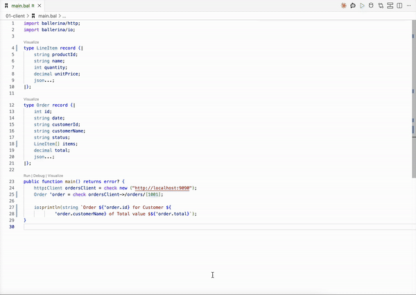

# 1. Client — call an HTTP backend

Fetch data from an HTTP backend and print it. Two calls: `GET /orders/1001` (single order) and `GET /orders` (list).

## Steps

### 1. Start the orders backend

```
cd backends/orders && bal run
```

Runs on `http://localhost:9090`.

### 2. Create the Ballerina package

```
bal new automation
cd automation
```

### 3. Generate the `Order` record

`GET /orders/1001` returns:

```json
{
  "id": 1001,
  "date": "2026-07-29",
  "customerId": "CUST-42",
  "customerName": "Alice Perera",
  "status": "COMPLETED",
  "items": [
    { "productId": "SKU-1", "name": "Widget", "quantity": 2, "unitPrice": 19.99 }
  ],
  "total": 39.98
}
```

Copy the sample JSON payload, and with a `.bal` file open, run the VS Code Ballerina command **Paste JSON as Record**. Rename the outer record to `Order`.

### 4. Implement the logic

Implement the logic to retrieve the order by ID `1001` as a path parameter.

### 5. Add the list-fetch using the flow view

Extend `main` with a second call — `GET /orders` — built visually in VS Code's flow view instead of typed by hand.



### 6. Run

```
bal run
```

Expected output:

```
Order 1001 for Customer Alice Perera of Total value $39.98
Order 1001 for Customer Alice Perera of Total value $39.98
Order 1002 for Customer Bob Silva of Total value $149.99
...
```

The first line is the single-order fetch from step 4; the rest come from iterating the list built in step 5.

## Next

- Sample 2 — the same fetch, with the response typed as raw `json`, and a second variant using XML from the customers backend.
- Sample 3 — the same fetch, with the client and record types generated from an OpenAPI spec.
