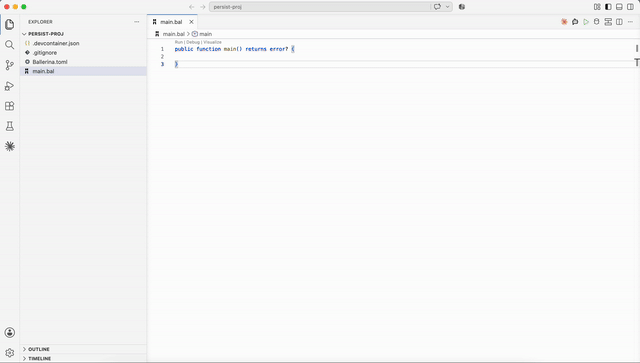

# 8. Persist — code-generated data access

Same read as sample 7, but the data access layer is **generated** by `bal persist` from a record definition. No hand-written SQL, no `sql:ParameterizedQuery` — resource-style calls against a typed client (`dbClient->/products`, `dbClient->/products/[id]`, `dbClient->/products.post([...])`). `main.bal` fetches one product; the extended example at the end wraps the same client in a full CRUD HTTP service.

## Steps

### 1. Start Postgres

```
cd 08-persist
docker compose up -d
```

Runs the seeded `Product` table from `init.sql`.

### 2. Create the package and initialize persist

```
bal new products_persist
cd products_persist
bal persist add --datastore postgresql --module products
```

`bal persist add` writes a `[[tool.persist]]` block into `Ballerina.toml` and creates an empty `persist/model.bal`.

### 3. Define the data model

In `persist/model.bal`:

```ballerina
import ballerina/persist as _;
import ballerinax/persist.sql;

type Product record {|
    readonly string id;
    string name;
    @sql:Decimal {precision: [10, 2]}
    decimal price;
    int stock;
    string category;
|};
```

- `readonly` marks the primary key.
- `@sql:Decimal {precision: [10, 2]}` pins the SQL column type so prices render as `19.99`, not `19.990000000000000000000000000000` (the default is `DECIMAL(65,30)`).

`bal build` regenerates the client on every build. Generated code lives in `generated/products/`.

### 4. Configure the connection

The generated `configurable` values live in the `products_persist.products` module, so the section header uses that path:

```toml
[products_persist.products]
host = "localhost"
port = 5432
user = "tutorial"
database = "products"
password = "tutorial"
```

Copy `Config.toml.example` to `Config.toml`.

### 5. Write `main` using the generated client

```ballerina
import products_persist.products as store;

final store:Client dbClient = check new;

public function main() returns error? {
    store:Product product = check dbClient->/products/["SKU-1"];
    io:println("Fetched: ", product);
}
```

### 6. Run

```
bal run
```

Output:

```
Fetched: {"id":"SKU-1","name":"Widget","price":19.99,"stock":120,"category":"TOOLS"}
```

## Why persist vs raw `sql:`

Sample 7 works — the trade-off is what you write and maintain:

- **Typed CRUD, no query strings.** The generated client exposes `->/products`, `->/products/[id]`, `->/products.post(...)`, `.put(...)`, `.delete()` — no SQL to write, no interpolation to get right.
- **Swap datastores from the same model.** `--datastore postgresql` today, `--datastore mysql` (or `mssql`, `redis`, `inmemory` for tests, ...) tomorrow — regenerate, no code changes.
- **Schema evolution stays honest.** Change the model, rebuild, and both the client and `script.sql` update together.

## Generated code

Under `generated/products/`:

- `persist_client.bal` — the typed CRUD client
- `persist_types.bal` — `Product`, `ProductInsert`, `ProductUpdate` records
- `persist_db_config.bal` — the `configurable` variables the client uses (`host`, `port`, `user`, `database`, `password`)
- `script.sql` — the SQL schema for reference (mirrored in `init.sql`)

## Client method surface

```ballerina
// list — returns a stream, consumed with a query expression
stream<Product, persist:Error?> s = dbClient->/products(whereClause = `category = ${category}`);

// get by id
Product|persist:Error one = dbClient->/products/[productId];

// insert (takes an array, returns the ids)
string[]|persist:Error ids = dbClient->/products.post([product]);

// update / delete also exist:
//   dbClient->/products/[id].put({name: "..."})
//   dbClient->/products/[id].delete()
```

## Building it in the flow view

The same flow constructed visually — no need to type the client call by hand.



## Extended example — a full CRUD service

The same client wrapped in an HTTP service with list/filter/get-by-id/create endpoints. Same shape as sample 10, backed by the persist client.

```ballerina
import ballerina/http;
import ballerina/persist;
import products_persist.products as store;

public enum ProductCategory {
    TOOLS,
    ELECTRONICS,
    HARDWARE
}

configurable int servicePort = ?;

final store:Client dbClient = check new;

service /products on new http:Listener(servicePort) {

    resource function get .(ProductCategory? category = ()) returns store:Product[]|persist:Error {
        stream<store:Product, persist:Error?> productStream;
        if category is () {
            productStream = dbClient->/products();
        } else {
            productStream = dbClient->/products(whereClause = `category = ${category}`);
        }
        return from store:Product p in productStream select p;
    }

    resource function get [string productId]() returns store:Product|http:NotFound|persist:Error {
        store:Product|persist:Error result = dbClient->/products/[productId];
        if result is persist:NotFoundError {
            return http:NOT_FOUND;
        }
        return result;
    }

    resource function post .(store:Product product) returns http:Created|http:Conflict|persist:Error {
        string[]|persist:Error inserted = dbClient->/products.post([product]);
        if inserted is persist:AlreadyExistsError {
            return http:CONFLICT;
        }
        if inserted is persist:Error {
            return inserted;
        }
        return http:CREATED;
    }
}
```

Add `servicePort = 9095` to `Config.toml` for the service. With that in place, `api.hurl` in this directory drives each endpoint.

## Tear down

```
docker compose down
```
